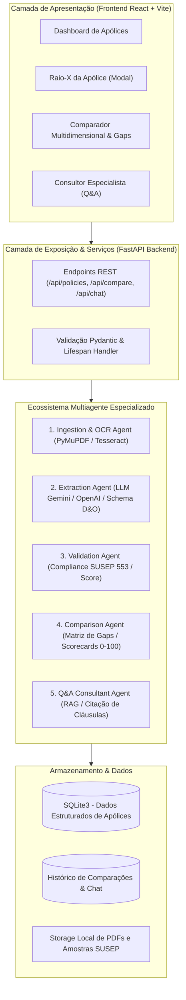

# InsurMinds Apólice 360 🛡️⚖️
### Plataforma Inteligente para Análise, Extração e Comparação de Apólices D&O com IA Generativa

[](LICENSE)
[](https://www.python.org/)
[](https://fastapi.tiangolo.com/)
[](https://react.dev/)
[](https://i2a2.academy/)

---

## 📌 1. Descrição do Projeto

O **InsurMinds Apólice 360** é uma solução de inteligência artificial de ponta desenvolvida como projeto final de conclusão do curso avançado do **Instituto de Inteligência Artificial Aplicada (I2A2)**. 

Apólices de seguro D&O (*Directors and Officers*) são contratos de extrema complexidade, com dezenas de páginas redigidas em linguagem jurídica minuciosa. A comparação manual de diferentes propostas comerciais consome incontáveis horas de especialistas e expõe empresas e conselheiros a graves riscos de omissão de coberturas (*gaps* de proteção), assimetrias de franquias (POS) e restrições patrimoniais imediatas (penhoras judiciais online).

O **InsurMinds Apólice 360** automatiza todo o ciclo analítico através de uma **arquitetura de múltiplos agentes de IA especializados**, realizando:
1. **Recepção e Ingestão Híbrida**: leitura de contratos digitais e digitalizados/escaneados em PDF e imagens com preservação rigorosa de paginação.
2. **Extração Semântica Estruturada**: mapeamento automático de entidades atuariais críticas (LMG, Sublimites, Franquias/POS, Coberturas Básicas, Extensões e Exclusões).
3. **Auditoria de Conformidade Regulatória**: validação de integridade contratual conforme a **Circular SUSEP 553/2017**.
4. **Comparação 360º e Detecção de Gaps**: confronto multidimensional entre 2 ou mais apólices, gerando matriz de divergências, cálculo de scorecards de proteção e parecer executivo fundamentado.
5. **Consultor Securitário RAG (Chat Inteligente)**: assistente conversacional capaz de responder a dúvidas técnicas citando as cláusulas e páginas do contrato original.

---

## 🏗️ 2. Arquitetura da Solução & Ecossistema Multiagente

A solução adota uma arquitetura modular baseada em agentes autônomos com separação estrita de responsabilidades:



### Detalhamento dos Agentes:
- **`IngestionAgent`**: Valida arquivos recebidos, extrai texto digital via PyMuPDF ou aciona OCR (Tesseract / Vision) em documentos escaneados.
- **`ExtractionAgent`**: Atua como perito atuário, extraindo valores de LMG, sublimites, franquias, coberturas e cláusulas de exclusão.
- **`ValidationAgent`**: Realiza checagens de regras de negócio (limites <= LMG global, coerência cronológica) e calcula o índice de confiança da extração.
- **`ComparisonAgent`**: Compara 2 ou mais apólices, identifica coberturas exclusivas (gaps), gera matriz de prós e contras e emite o parecer executivo para a diretoria.
- **`QnAAgent`**: Responde a consultas livres em linguagem natural, citando a apólice, o número da cláusula e as páginas de referência.

---

## 🛠️ 3. Tecnologias Utilizadas

- **Linguagem**: Python 3.11
- **Backend**: FastAPI 0.141+, Uvicorn, Starlette
- **Modelagem & Validação**: Pydantic v2
- **IA Generativa & LLM**: Google Gemini API / OpenAI API com **motor especialista heurístico de fallback offline**
- **OCR e Processamento de Documentos**: PyMuPDF (`fitz`), Pillow, PyTesseract
- **Persistência**: SQLite3 nativo com serialização JSON e índices de busca
- **Frontend**: React 18, Vite, Lucide Icons, Design System Dark Fintech com CSS moderno
- **Geração de Entregáveis**: `python-pptx`, `reportlab`, `opencv-python`
- **Testes Automatizados**: `pytest`, `pytest-asyncio`, FastAPI TestClient

---

## 💻 4. Instruções de Instalação

### Pré-requisitos:
- Python 3.11 instalado ([Download Python](https://www.python.org/downloads/))
- Node.js 18+ e npm ([Download Node.js](https://nodejs.org/))
- Git

### Passo a Passo:

1. **Clonar o Repositório**:
   ```bash
   git clone https://github.com/usuario/insurminds-apolice-360.git
   cd insurminds-apolice-360
   ```

2. **Criar e Ativar Ambiente Virtual (Recomendado)**:
   ```bash
   # Windows (PowerShell)
   python -m venv venv
   .\venv\Scripts\Activate.ps1

   # Linux / macOS
   python3 -m venv venv
   source venv/bin/activate
   ```

3. **Instalar Dependências Python**:
   ```bash
   pip install -r requirements.txt
   ```

4. **Instalar Dependências do Frontend**:
   ```bash
   cd frontend
   npm install
   npm run build
   cd ..
   ```

5. **Configurar Variáveis de Ambiente (Opcional)**:
   O sistema possui um **motor especialista securitário embarcado** que funciona 100% offline para avaliação imediata. Caso deseje utilizar chaves de API externas, crie um arquivo `.env` na raiz:
   ```env
   GEMINI_API_KEY=sua_chave_gemini_aqui
   # ou
   OPENAI_API_KEY=sua_chave_openai_aqui
   ```

---

## 🚀 5. Instruções de Execução

### Opção 1: Execução Completa (Backend FastAPI + Frontend React)

1. **Iniciar o Backend FastAPI**:
   ```bash
   python -m uvicorn backend.app.main:app --host 0.0.0.0 --port 8000 --reload
   ```

2. **Iniciar o Frontend Vite (Modo Desenvolvimento)**:
   Em outro terminal:
   ```bash
   cd frontend
   npm run dev
   ```

3. **Acessar a Aplicação**:
   - Frontend Interativo: [http://localhost:5173](http://localhost:5173) (ou [http://localhost:8000](http://localhost:8000))
   - Documentação Interativa da API (Swagger): [http://localhost:8000/docs](http://localhost:8000/docs)
   - Status de Saúde da API: [http://localhost:8000/health](http://localhost:8000/health)

---

## 🧪 6. Execução dos Testes Automatizados

O projeto conta com suite completa de testes automatizados unitários e de integração cobrindo extração, comparação e endpoints HTTP:

```bash
python -m pytest backend/tests/ -v
```

---

## 📦 7. Pasta de Entregáveis Oficiais (`Projeto_Final_Artefatos/`)

Conforme especificado na página 22 do edital do I2A2, todos os artefatos formais foram depositados na pasta `Projeto_Final_Artefatos/`:

| Artefato | Nome do Arquivo | Descrição |
| :--- | :--- | :--- |
| **Relatório Técnico (PDF)** | `InsurMinds_Relatorio_Tecnico.pdf` | Documento formal contendo arquitetura, justificativas, fluxo, agentes, limitações e roadmap |
| **Apresentação Pitch Deck** | `InsurMinds_Projeto_Final.pptx` | Slides executivos seguindo as diretrizes do Sebrae para pitches de alto impacto |
| **Vídeo de Apresentação** | `InsurMinds_Projeto_Final.mp4` | Vídeo demonstrando problema, arquitetura, execução da plataforma e principais resultados (< 5 min) |
| **Roteiro do Vídeo** | `ROTEIRO_VIDEO_DEMO.md` | Guia completo de locução e minutagem (0:00 a 4:45) |

---

## 👥 8. Identificação dos Integrantes

**Equipe InsurMinds - Turma de Inteligência Artificial Aplicada (I2A2):**
- Diogo (Líder Técnico & Engenheiro de IA)
- Equipe InsurMinds

---

## 📄 9. Licença de Software

Este projeto está licenciado sob os termos da **MIT License** - consulte o arquivo [LICENSE](LICENSE) para obter detalhes completos.
