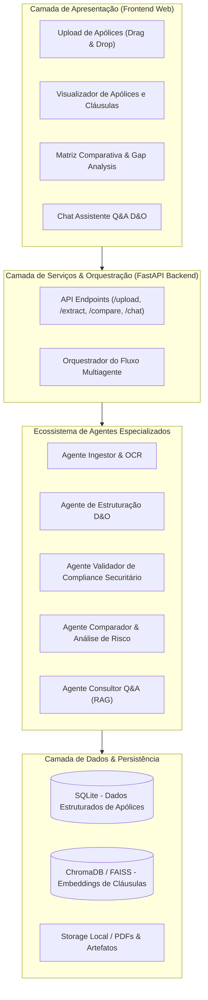

# Plano de Implantação: InsurMinds - Plataforma Inteligente para Análise e Comparação de Apólices D&O

## Objetivo do Projeto
Atender de forma exemplar a todos os requisitos e critérios de avaliação do **Projeto Final do Instituto de Inteligência Artificial Aplicada (I2A2)** contidos em `Projeto Final.pdf`. O objetivo central é construir um protótipo funcional (MVP) de alta consistência técnica, arquitetura modular baseada em agentes de IA Generativa, documentação completa e geração de todos os entregáveis formais solicitados pela banca avaliadora.

---

## Mapeamento de Conformidade com o Edital / Requisitos

| Requisito do Documento (I2A2) | Atendimento na Solução InsurMinds | Status |
| :--- | :--- | :---: |
| **Leitura de PDF ou imagem** | Pipeline híbrido com suporte a PDFs textuais (PyPDF/pdfplumber) e escaneados/imagens (Tesseract OCR / LLM multimodal) | Planejado |
| **Extração automática de informações** | Agente extrator baseado em IA estruturando entidades D&O (LMG, POS/franquias, vigência, coberturas e exclusões) | Planejado |
| **Estruturação organizada dos dados** | Esquemas Pydantic tipados com persistência em SQLite relacional e indexação vetorial | Planejado |
| **Comparação entre ≥ 2 apólices** | Agente de Comparação gerando matriz lado a lado, mapa de assimetrias e análise de lacunas | Planejado |
| **Apresentação de diferenças e recomendações** | Painel visual de diferenças, destaque de cláusulas críticas, radar de risco e parecer executivo | Planejado |
| **Pelo menos um modelo de IA Generativa** | Integração via Gemini API / OpenAI API com fallback estruturado para testes offline/demonstração | Planejado |
| **Interface de demonstração funcional** | Web App moderna, responsiva e com UX corporativa (Fintech/Insurtech) com chat Q&A interativo | Planejado |
| **Relatório Técnico (PDF)** | Documento formal contendo arquitetura, justificativas, fluxo, agentes, limitações e roadmap | Planejado |
| **Pitch Deck (`InsurMinds_Projeto_Final.pptx`)** | Apresentação em formato Pitch Deck corporativo conforme metodologia recomendada pelo Sebrae | Planejado |
| **Vídeo (`InsurMinds_Projeto_Final.mp4`)** | Roteiro e gravação/geração da demonstração do MVP com tempo inferior a 5 minutos | Planejado |
| **Repositório GitHub & `Projeto_Final_Artefatos`** | Estrutura de pastas padronizada, README com badges, MIT License e pasta de artefatos | Planejado |

---

## Arquitetura da Solução



---

## Componentes Especializados dos Agentes

1. **Agente Ingestor e OCR (`IngestionAgent`)**:
   - Valida tipo de arquivo (PDF, PNG, JPG).
   - Extrai texto nativo com preservação de paginação. Se o arquivo for imagem ou PDF digitalizado, aciona OCR/Vision.
   - Higieniza e segmenta em blocos estruturais (Condições Gerais, Condições Especiais, Quadro Demonstrativo de Limites).

2. **Agente de Estruturação D&O (`ExtractionAgent`)**:
   - Aplica prompts com esquemas formais Pydantic focados em seguros D&O:
     - **Metadados**: Seguradora, Número da Apólice, Tomador, Período de Vigência.
     - **Valores Financeiros**: Limite Máximo de Garantia (LMG) principal, sub-limites, moeda.
     - **Participação Obrigatória do Segurado (POS / Franquias)**: Franquias gerais e específicas (ex: investigações, valores mobiliários).
     - **Coberturas Básicas & Adicionais**: Custos de defesa, multas administrativas, penhora online, responsabilidade solidária, crise de reputação.
     - **Exclusões & Restrições**: Atos dolosos, fraude comprovada, poluição ambiental gradual, ganhos pessoais ilegais.
     - **Retroatividade & Prazos**: Data de retroatividade e prazo complementar/suplementar.

3. **Agente Validador de Consistência (`ValidationAgent`)**:
   - Valida se os limites individuais superam o LMG global.
   - Avalia a completude da extração e gera um **Índice de Qualidade de Dados (0-100%)**.
   - Sinaliza advertências de ambiguidades jurídicas nas cláusulas.

4. **Agente Comparador (`ComparisonAgent`)**:
   - Compara duas ou mais apólices estruturadas em matriz uniforme.
   - Identifica:
     - **Diferenças de Limite e Franquia** (quem protege mais por menor custo).
     - **Coberturas Exclusivas** (presentes em uma e ausentes na outra).
     - **Diferenças em Exclusões** (qual apólice é mais restritiva ao executivo).
   - Produz um **Parecer Executivo Recomendatório** com prós e contras para a diretoria.

5. **Agente Consultor Q&A (`QnAAgent`)**:
   - Responde perguntas dos usuários apontando exatamente a cláusula e a página do documento de origem.

---

## Estrutura do Repositório Proposta

```text
Projeto Final/
├── .env.example
├── .gitignore
├── LICENSE                          # Licença MIT obrigatória
├── README.md                        # Documentação executiva completa com badges e guia de instalação
├── requirements.txt                 # Dependências Python
├── package.json                     # Scripts e dependências de frontend
├── InsurMinds_Relatorio_Tecnico.pdf # Relatório técnico exigido
├── Projeto_Final_Artefatos/         # Pasta exigida na pág. 22 do edital
│   ├── InsurMinds_Projeto_Final.pptx # Apresentação Pitch Deck
│   ├── InsurMinds_Projeto_Final.mp4  # Vídeo gravado da demonstração
│   ├── InsurMinds_Relatorio_Tecnico.pdf # Cópia formal do relatório técnico
│   └── architecture_diagram.png     # Diagrama visual de arquitetura
├── data/
│   └── samples/                     # 3 apólices D&O modelo públicas (Susep / Seguradoras reais)
│       ├── apolice_alpha_dno_standard.pdf
│       ├── apolice_beta_dno_corporate.pdf
│       └── apolice_gamma_dno_premium.pdf
├── backend/
│   ├── app/
│   │   ├── __init__.py
│   │   ├── main.py                  # Servidor FastAPI
│   │   ├── config.py                # Configurações de ambiente e chaves
│   │   ├── agents/                  # Agentes de IA especializados
│   │   │   ├── __init__.py
│   │   │   ├── base.py
│   │   │   ├── ingestion_agent.py
│   │   │   ├── extraction_agent.py
│   │   │   ├── validation_agent.py
│   │   │   ├── comparison_agent.py
│   │   │   └── qna_agent.py
│   │   ├── models/                  # Esquemas Pydantic e modelos ORM
│   │   │   ├── policy_schema.py
│   │   │   └── comparison_schema.py
│   │   ├── services/                # OCR, LLM client, vector search
│   │   │   ├── llm_service.py
│   │   │   ├── ocr_service.py
│   │   │   └── storage_service.py
│   │   └── routes/                  # Rotas da API REST
│   │       ├── policies.py
│   │       ├── comparison.py
│   │       └── chat.py
│   └── tests/                       # Testes automatizados unitários e de integração
│       ├── test_extraction.py
│       └── test_comparison.py
├── frontend/                        # Interface Web moderna e responsiva
│   ├── index.html
│   ├── src/
│   │   ├── App.jsx
│   │   ├── components/
│   │   │   ├── Header.jsx
│   │   │   ├── DocumentUpload.jsx
│   │   │   ├── PolicyViewer.jsx
│   │   │   ├── ComparisonMatrix.jsx
│   │   │   ├── RiskRadar.jsx
│   │   │   └── PolicyChat.jsx
│   │   └── styles/
│   │       └── index.css
│   └── vite.config.js
└── scripts/
    ├── generate_report.py           # Gera o PDF do Relatório Técnico
    ├── generate_pitch_deck.py       # Gera a apresentação PPTX formatada
    └── seed_sample_policies.py      # Popula apólices reais/sintéticas D&O para demo
```

---

## Fases de Execução do Plano

### Fase 1: Setup do Ambiente e Base de Dados de Amostra
- Configurar ambiente virtual Python e dependências (`fastapi`, `uvicorn`, `pydantic`, `pypdf`, `pdfplumber`, `python-pptx`, `reportlab`, `matplotlib`).
- Criar 3 apólices D&O de amostra realistas e ricas em dados (com cláusulas de limites, franquias POS, coberturas de custos de defesa, poluição, retroatividade) para validação imediata.

### Fase 2: Desenvolvimento do Núcleo de Agentes de IA & Backend
- Implementar o `llm_service.py` com suporte à API (Gemini/OpenAI) e mecanismo de fallback inteligente que garante funcionamento mesmo sem chave externa.
- Construir os esquemas Pydantic detalhados em `policy_schema.py`.
- Construir o `IngestionAgent` (extração de texto e metadados).
- Construir o `ExtractionAgent` (estruturação das apólices D&O).
- Construir o `ComparisonAgent` (análise comparativa entre 2 ou mais apólices, cálculo de gaps e recomendações).
- Construir o `QnAAgent` para responder perguntas pontuais com citação de cláusulas.
- Criar os endpoints REST em FastAPI e testes unitários.

### Fase 3: Desenvolvimento do Frontend Web Interativo
- Construir a interface com design moderno e premium (tons escuros elegantes, azul royal, grafite e destaques em ciano, tipografia profissional).
- Módulos da UI:
  1. *Dashboard / Upload*: visualização de apólices cadastradas com badges de status e botão para carregar novas apólices ou usar as de demonstração.
  2. *Visualizador da Apólice*: ficha técnica detalhada da apólice com LMG, franquias, coberturas e exclusões.
  3. *Módulo Comparador Lado a Lado*: seleção de 2 ou mais apólices com tabela comparativa, indicadores visuais de vantagens/desvantagens e resumo executivo de recomendação.
  4. *Chat Inteligente com as Apólices*: Q&A com streaming de resposta.

### Fase 4: Produção dos Entregáveis Formais Obrigatórios
- **Relatório Técnico (`InsurMinds_Relatorio_Tecnico.pdf`)**:
  - Gerar o PDF completo com todas as seções exigidas (Arquitetura, Tecnologias, Agentes, Fluxo de Processamento, Justificativa de Decisões, Limitações Conhecidas, Possibilidades Futuras).
- **Pitch Deck (`InsurMinds_Projeto_Final.pptx`)**:
  - Gerar a apresentação corporativa de 10 a 12 slides cobrindo o problema do mercado de seguros D&O, a proposta de valor, arquitetura técnica de IA, demonstração do fluxo e modelo de negócios.
- **Roteiro e Geração do Vídeo (`InsurMinds_Projeto_Final.mp4`)**:
  - Preparar script de apresentação com minutagem detalhada (máximo de 5 min) e gerar a demonstração interativa gravada da aplicação em execução.
- **Pasta `Projeto_Final_Artefatos/`**:
  - Copiar os arquivos nos nomes e formatos exatos solicitados no documento.

### Fase 5: Validação, Testes e Documentação Final
- Executar testes automatizados no backend.
- Validar fluxo completo de ponta a ponta (upload -> extração -> comparação -> chat).
- Criar `README.md` exemplar com guia de instalação, prints/diagramas, badges e licença MIT.

---

## Plano de Verificação

### Testes Automatizados
- Executar `pytest backend/tests/` para validar a integridade dos esquemas, extração e comparação.
- Testar endpoints FastAPI via scripts de teste com verificação de payload HTTP 200.

### Verificação Manual
- Acessar a aplicação no navegador em `http://localhost:5173` ou `http://localhost:8000`.
- Fazer upload de duas apólices D&O diferentes.
- Validar se a extração automática preencheu todos os campos (LMG, coberturas, franquias).
- Rodar o comparador e verificar a geração da matriz de diferenças e recomendações.
- Fazer uma pergunta no chat (ex: "Qual apólice possui melhor cobertura para custos de defesa?") e conferir a resposta fundamentada.
- Validar abertura e formatação de `InsurMinds_Projeto_Final.pptx` e `InsurMinds_Relatorio_Tecnico.pdf`.
